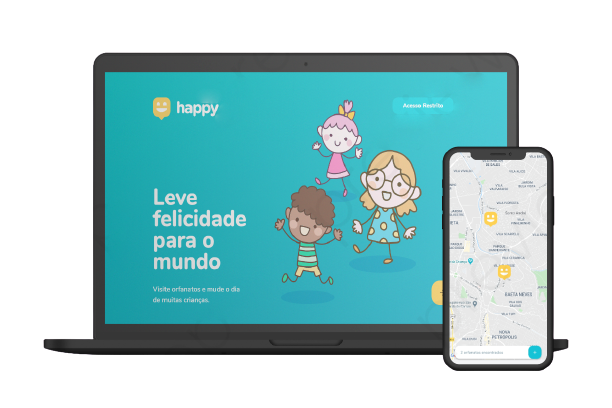

<h1 align="center">
    
</h1>

Leve felicidade para o mundo, visite orfanatos e mude o dia de muitas crianças. Projeto realizado na NLW#3.

<h4 align="center">
    Versão 1.2 🚀
</h4>

  <a href="#-sobre">Sobre</a>&nbsp;&nbsp;&nbsp;|&nbsp;&nbsp;&nbsp;
  <a href="#-layout">Layout</a>&nbsp;&nbsp;&nbsp;|&nbsp;&nbsp;&nbsp;
  <a href="#-tecnologias">Tecnologias</a>&nbsp;&nbsp;&nbsp;|&nbsp;&nbsp;&nbsp;
  <a href="#-rotas-do-backend">Rotas Backend</a>&nbsp;&nbsp;&nbsp;|&nbsp;&nbsp;&nbsp;
  <a href="#-to-do">To-Do</a>&nbsp;&nbsp;&nbsp;|&nbsp;&nbsp;&nbsp;
  <a href="#-licença">Licença</a>

  

  

  

  

  

----

## 💡 Sobre

O Happy é uma aplicação que conecta pessoas à casas de acolhimento institucional para fazer o dia de muitas crianças mais feliz 💜

Este projeto foi construído durante a terceira edição do evento Next Level Week da [Rocketseat](https://rocketseat.com.br/).

  

    

## 🎨 Layout

Nos links abaixo você encontra o layout do projeto web e também do mobile. Lembrando que você precisa ter uma conta no [Figma](http://figma.com/) para acessá-lo.

- [Layout Web](https://www.figma.com/file/29mYCcFIkqyYFE6eVT7kJ3/Happy-Web-2.0)
- [Layout Mobile](https://www.figma.com/file/Q6uftMn2Z2873lBUhymF95/Happy-Mobile-OmniStack)

## 🛠️ Tecnologias

Esse projeto foi desenvolvido usando as seguintes tecnologias:

#### Frontend Web
- [ReactJS](https://pt-br.reactjs.org)
- [Typescript](typescriptlang.org/)
- [Axios](https://github.com/axios/axios)
- [Mapbox API](https://www.mapbox.com/)
- [Leaflet](https://leafletjs.com)
- [React Leaflet](https://react-leaflet.js.org)
- [React Router](https://reactrouter.com/)
- [React Icons](https://react-icons.github.io/react-icons/)
- [React Phone Number Input](https://www.npmjs.com/package/react-phone-number-input/)
- [Framer Motion](https://www.framer.com/motion/)
- [SweetAlert2](https://www.npmjs.com/package/sweetalert2)
- [Toastify](https://www.npmjs.com/package/react-toastify)

#### Frontend Mobile
- [React Native](https://reactnative.dev)
- [React Navigation](https://reactnavigation.org)
- [React Native Maps](https://github.com/react-native-maps/react-native-maps)
- [Typescript](typescriptlang.org/)
- [Expo](https://expo.io)
- [Axios](https://github.com/axios/axios)

#### Backend
- [NodeJS](https://nodejs.org/)
- [Express](https://expressjs.com/pt-br/)
- [Typescript](https://typescriptlang.org/)
- [TypeORM](https://typeorm.io#/)
- [SQLite 3](https://www.sqlite.org/)
- [Multer](https://www.npmjs.com/package/multer)
- [Yup](https://www.npmjs.com/package/yup)
- [Bcrypt](https://www.npmjs.com/package/bcrypt)
- [JSON Web Token](https://www.npmjs.com/package/jsonwebtoken)

## 🍃 Rotas do Backend

#### Orfanatos
Resource URI          | Método HTTP | Finalidade
--------------------- | ----------- | -------
/orphanages           | GET         | Lista de Orfanatos
/orphanages/{ID}      | GET         | Lista Individual de um Orfanato
/orphanages           | POST        | Cadastra um novo Orfanatos
/orphanages/{ID}      | DELETE      | Remove um Orfanato 

#### Autenticação
Resource URI          | Método HTTP | Finalidade
--------------------- | ----------- | -------
/auth/authenticate    | POST        | Autentificação de um usuário
/auth/register        | POST        | Registro de um usuário

## 📝 To-Do

- [x] ~~Contato WhatsApp~~
- [x] ~~Integração com o SweetAlert2~~
- [x] ~~Title TAG de acordo com a página atual~~
- [x] ~~Integração com o Geolocation~~
- [x] ~~Animações (Framer Motion)~~
- [x] ~~Counter de Orfanatos no mapa~~
- [x] ~~Autenticação/Acesso Restrito~~
- [x] ~~Remover orfanato~~
- [ ] Melhoria na autenticação
- [ ] Dark Mode
- [ ] Opções para Contato (Sem WhatsApp)
- [ ] Responsividade

## ⚙️ Como contribuir

- Faça um fork desse repositório;
- Crie uma branch com a sua feature: `git checkout -b minha-feature`;
- Faça commit das suas alterações: `git commit -m 'feat: Minha nova feature'`;
- Faça push para a sua branch: `git push origin minha-feature`;

Após o merge da sua pull request for realizado, você pode deletar a sua branch.

## 📝 Licença

Esse projeto está sob a licença MIT. Veja o arquivo [LICENSE](https://github.com/carlosmfreitas2409/nlw-03-happy/blob/master/LICENSE).

---

Feito com 💜 por Carlos Eduardo.
